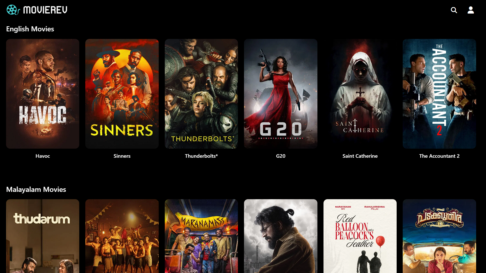
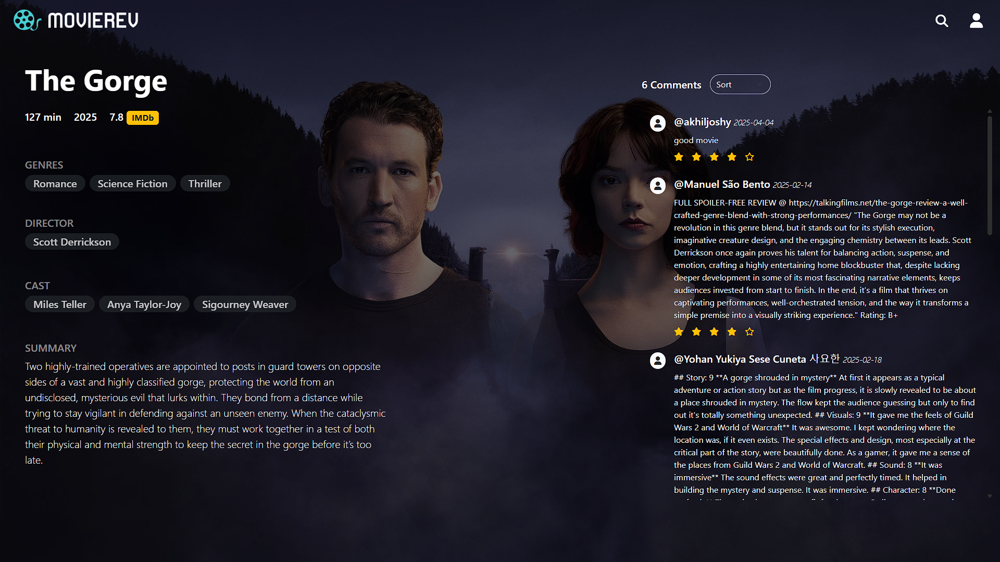
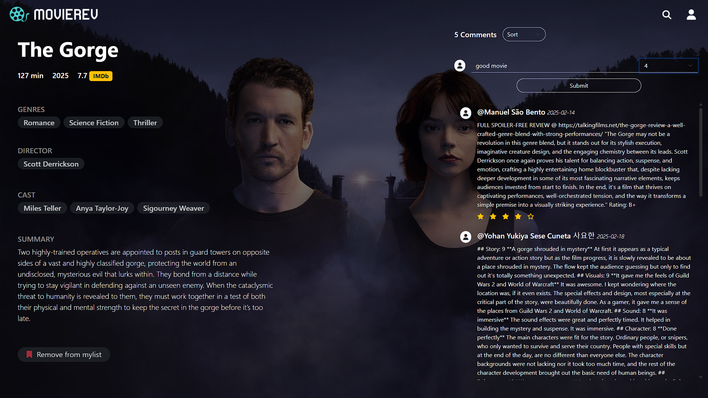
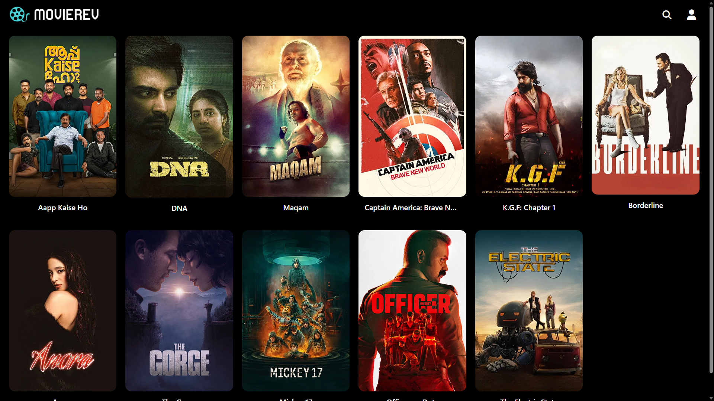
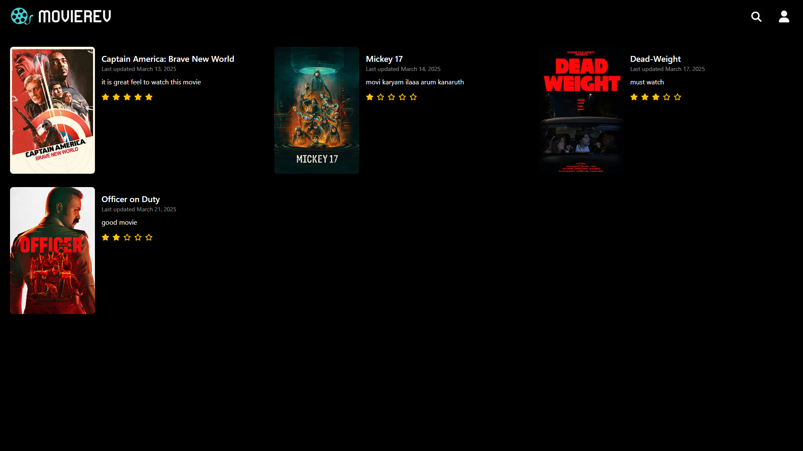

# 🎬 MovieRev – Movie Review Web App

MovieRev is a movie review platform built with Django where users can explore and review movies. Visitors can read reviews without logging in, while registered users can add reviews, manage a wishlist, and view their review history.

---

## 🚀 Features

- 🔍 View reviews of the latest and classic movies without login
- 📝 Logged-in users can post **one review per movie**
- 📊 Sort reviews by **latest** or **top-rated**
- 🌟 Add movies to **My List** (wishlist)
- 👤 View all movies a user has reviewed
- 🎥 Fetch real-time movie details using the **TMDB API**

---

## 🛠 Tech Stack

- **Backend:** Python, Django
- **Frontend:** Django Templates, HTML, CSS, Bootstrap
- **API Integration:** [TMDB API](https://www.themoviedb.org/documentation/api)

---

## 🖼 Screenshots

### 🏠 Home Page


### 🔍 Movie Detail Page


### 📝 Add Review (Logged In)


### ⭐ My List (Wishlist)


### 👤 My Reviews Page


---

## 🔧 Setup Instructions

1. Clone the repo:
   ```bash
   git clone https://github.com/akhilejoshy/movierev.git
   cd movierev
